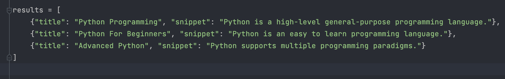
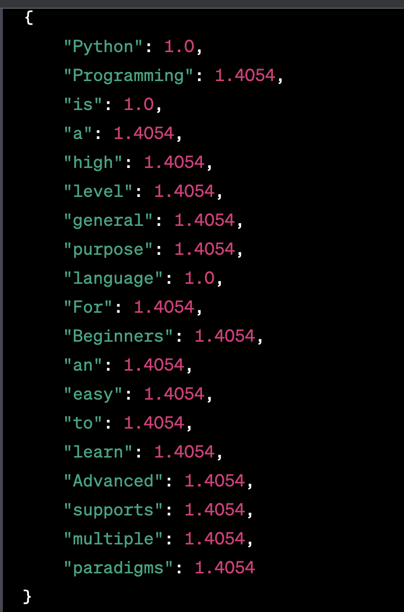
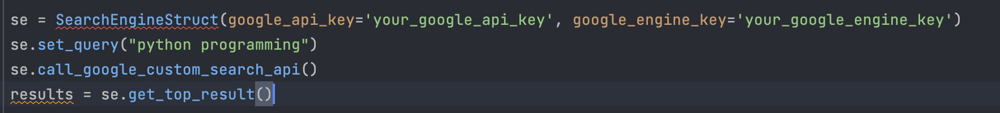
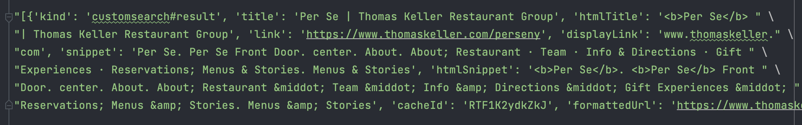
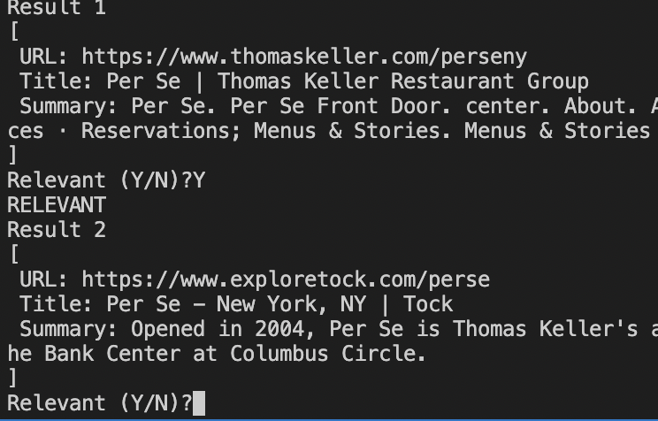

Examples
=============

* * cal_tfidf(results) --> Returns a dictionary with words as keys and their corresponding TF-IDF scores as values
    Input is the document that we have classifed, the output can be used for further query or words generations.

* * Firstly, set the query for our SearchEngine, and connect to googole search API.
    SearchEngineStruct.__init__ and SearchEngineStruct.call_google_custom_search_api(self)
    After that, we can get the top10.
    SearchEngineStruct.get_top_result(self) --> Returns a list of top results
    The output will be the top 10 result for the search result of query = self.query.
    The format of outout is in json, so you can easily use it for futher purpose.

* * After get the top 10 result, user can manually pick the stuff they want,
    so we collect their feedback for further use.

